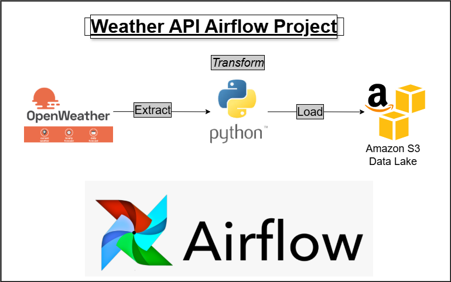

# Weather API Airflow Project

This project is designed to extract weather data from the OpenWeather API, transform it using Python, and load the processed data into Amazon S3 storage. The entire process is orchestrated and automated using Apache Airflow.



## Project Workflow
1. **Data Extraction**: 
   - Weather data is fetched from the OpenWeather API.
   
2. **Data Transformation**: 
   - The extracted data is processed and cleaned using Python scripts to ensure it's ready for storage.
   
3. **Data Loading**:
   - The transformed data is then stored in AWS S3, ensuring scalable and secure data storage.

4. **Automation with Airflow**:
   - Apache Airflow manages the entire ETL (Extract, Transform, Load) pipeline, scheduling and monitoring the workflow for continuous data ingestion.

## Technologies Used
- **OpenWeather API**: Provides weather data such as temperature, humidity, and other weather-related metrics.
- **Python**: Used for data extraction and transformation.
- **AWS S3**: Cloud storage for the transformed data.
- **Apache Airflow**: Workflow management platform to schedule and monitor data pipelines.

## Prerequisites
- Python 3.x
- Apache Airflow
- AWS account for S3 storage
- OpenWeather API Key

## Setup Instructions

1. **Clone the repository**:
   ```bash
   git clone https://github.com/your-username/weather_api_airflow_st.git
